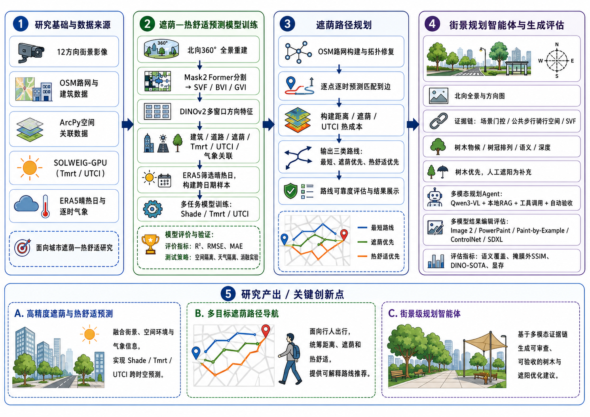

# 南京街道热舒适预测、遮荫路径导航与街景优化系统



## 主要功能

| 功能 | 对外入口 | 核心实现 |
|---|---|---|
| 热舒适模型训练与评估 | `python -m workflows.train_model` | `training/scripts/`、`training/src/` |
| 遮荫路径导航 | `python -m workflows.routing_navigation serve` | `routing/src/`、`routing/app/` |
| 街景优化与 Image2 结果登记 | `python -m workflows.streetscape_planning` | `streetscape/scripts/`、`routing/app/backend/` |

模型以街景语义和 DINOv2 视觉特征、太阳几何及逐小时气象变量为输入，预测遮荫率和平均辐射温度，并计算 UTCI。导航模块比较最短、遮荫优先、UTCI 优先和风险感知路线。街景模块识别道路、步行空间、建筑和植被，生成树冠布局、规划叠加图与结构化建议；没有坐标、天气或尺度校准时不输出正式降温数值。

南京案例在“未见点位和未见天气”测试集上的结果如下：

| 指标 | MAE | RMSE | R² |
|---|---:|---:|---:|
| 遮荫率 | 0.1092 | 0.1527 | 0.7081 |
| Tmrt | 2.1827 °C | 3.0147 °C | 0.9466 |
| UTCI | 0.5043 °C | 0.6957 °C | 0.9735 |

## 目录

```text
ThermalPrediction/
├── workflows/       # 统一命令入口和前置检查
├── data_pipeline/   # 多天气训练表构建
├── training/        # 模型、训练、评估和消融
├── routing/         # 路由引擎、接口和网页
├── streetscape/     # 街景感知与规划流程
├── docs/            # 数据字段和方法说明
├── environment.yml  # Conda 环境
└── README.md
```

## 安装

需要 Windows 10/11、Conda 和支持 CUDA 的 NVIDIA 显卡。重建 ArcGIS 路网时还需要单独安装 ArcGIS Pro；普通路由服务使用 GDAL，不依赖固定的本机 Conda 路径。

```powershell
conda env create -f environment.yml
conda activate gptthermalcomfort
```

## 本地运行资料

GitHub 不适合存放本项目约 79 GB 的原始影像、训练数组、路由成本和模型文件。运行前请从项目资料包恢复相同的相对路径。至少需要：

- 训练：`data/training_data/multiweather/step115_spatiotemporal_split/training_manifest_spatiotemporal.csv` 及清单引用的特征和标签。
- 导航：`routing/data/graph/step27_route_graph.npz`、`step27_hourly_costs.npz`、`step27_graph_metadata.json` 和 `routing/data/gazetteer/built/gazetteer_aliases.csv`。
- 街景：`streetscape/data/panorama/stage_04_formal/images/`、规划结果及本地视觉模型。

`.gitignore` 已排除上述资料、模型权重、缓存、日志、检查点和生成结果。

## 使用

所有入口默认先检查；只有显式传入 `--execute` 才运行训练或数据构建。

### 构建多天气训练表

```powershell
python -m workflows.data_pipeline --stages 112 113 114 115
python -m workflows.data_pipeline --stages 112 113 114 115 --execute
```

### 训练和评估

```powershell
python -m workflows.train_model
python -m workflows.train_model --execute
python -m workflows.train_model --execute --include-ablation
```

### 启动导航和街景网页

```powershell
python -m workflows.routing_navigation check
python -m workflows.routing_navigation serve
```

浏览器打开 `http://127.0.0.1:8765/`。本地大模型只解析需求和解释路线，路线本身由确定性路由引擎计算。

### 检查或运行街景规划

```powershell
python -m workflows.streetscape_planning check
python -m workflows.streetscape_planning panorama
python -m workflows.streetscape_planning localize
python -m workflows.streetscape_planning decide
python -m workflows.streetscape_planning visualize
```

Image2 是外部生成器。项目只准备和登记案例，不把外部服务密钥写入仓库：

```powershell
python streetscape/scripts/image2_generation_interface.py status
python streetscape/scripts/image2_generation_interface.py next
python streetscape/scripts/image2_generation_interface.py register --pair-id <ID> --generated-image <FILE>
```

### 导入 Image2 教师样本并进行模型预评估

`import_image2_teacher_examples.py` 按 `point_id` 和 `heading` 将外部 Image2
教师样本匹配到南京点位，并关联训练模型的标准化遮阴干预响应。外部影像和生成的表格均为本地资料，已由
`.gitignore` 排除，不提交到 GitHub。

输入包括教师样本的 `planner_ready_manifest.csv`，以及包含以下文件的热性能结果目录：

- `point_benefit_summary.csv`
- `point_hour_benefits.csv.gz`
- `summary.json`

先检查匹配关系和影像完整性，再生成本地示例：

```powershell
python streetscape/scripts/import_image2_teacher_examples.py `
  --teachers "D:\path\to\planner_ready_manifest.csv" `
  --benefits "D:\path\to\planner_citywide_performance" `
  --check

python streetscape/scripts/import_image2_teacher_examples.py `
  --teachers "D:\path\to\planner_ready_manifest.csv" `
  --benefits "D:\path\to\planner_citywide_performance" `
  --overwrite
```

结果写入 `streetscape/data/generation/stage_69_planner_ready_generation_package/`；其中
`example_manifest.csv` 是本地示例清单，`teacher_model_pre_evaluation.csv` 是教师样本与模型响应的关联表。
本次本地运行匹配了 1,000 对样本，其中 250 对满足标准化干预评估条件，并选取 12 对作为
train、val、test 示例。250 对可评估样本的平均预估为 Shade `+0.1553`、Tmrt `-2.73 °C`、
UTCI `-0.63 °C`。

这些数值来自训练模型对标准化遮阴干预的预评估，并非从生成图像像素重新提取的指标，也不是实测验证或
场地级因果效应。生成图像在本项目中用于方案展示，模型训练集上的测试指标用于说明预评估可信度边界。

## 技术说明

完整数据流见 `PIPELINE_SUMMARY.md`；字段定义见 `docs/DATA_DICTIONARY.md` 和 `docs/MODEL_INPUT_SPEC.md`。
